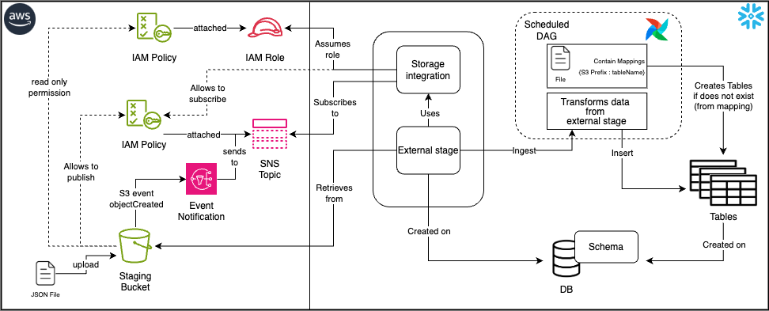

# S3-snowflake ETL pipeline

## Background

- scope the data requirements to build our e-commerce analytics platform (link to git project)
- use apache airflow and terraform to coordinate resources and automations from S3 bucket to snowflake

## Project requirements

### Phase 1: Build Components

- An S3 staging bucket to serve as an external stage to Snowflake. This is where raw data files land.
- An AWS Role that grants read access to the staging bucket. Snowflake assumes this role to access the external stage.
- An Event Notification gets triggered whenever new objects are placed in the staging bucket. It sends the details about the event to an SNS topic.
- An SNS (Simple Notification Service) topic receives the events and forwards them to the subscribed SQS (Simple Queue Service) in Snowflake.

### Phase 2: Build Components

- A storage integration allows users to load or unload data from an external stage without supplying credentials. It generates an IAM user that is granted the required permissions to access resources in AWS.
- The database and the corresponding schema that is to be created is where the external stage and destination table are going to be placed.
- An external stage references a cloud storage location outside of Snowflake. In this example, the external stage is mapped to an S3 bucket.

### Phase 3: Build Airflow Dag
- Prepare a dict 
  - {prefix : table name}
- create a function to create tables
  - for every {table name} in mappings, create a table if not created
  - must run every time and before ingestion takes place
- create a function to ingest and insert 
  - ingests from stage 
  - finds json keys
  - deposit values into appropriate tables

