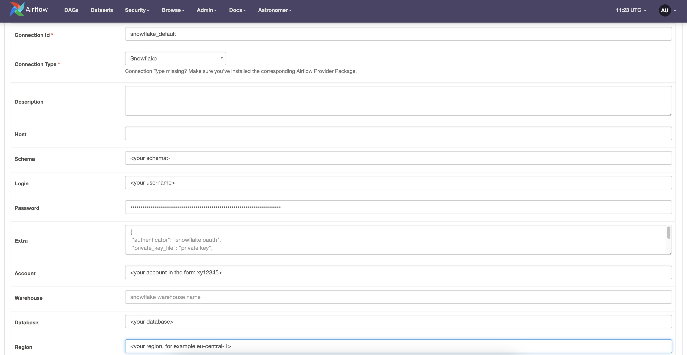

# steps for use

1. clone the repo into working directory
2. install requirements
   1. docker
   2. astro ([brew install astro](https://docs.astronomer.io/astro/cli/overview))
   3. astro python package ([pip install astro-sdk-python](https://pypi.org/project/astro-sdk-python/))
   4. airflow ([pip install apache-airflow](https://airflow.apache.org/docs/apache-airflow/stable/installation/installing-from-pypi.html), [pip install apache-airflow-providers-snowflake](https://airflow.apache.org/docs/apache-airflow-providers-snowflake/stable/index.html))
3. cd into terraform 
   1. prepare a file: terraform.tfvars
   2. structure of terraform.tfvars
        ```
        # Provider variables
        aws_profile                = "default" 
        aws_region                 = "<insert region here, e.g. ap-southeast-1>" 

        # To use as prefix when naming AWS resources. 
        project_code               = "awssnowpipe" # rename to any alphabet character you want
        region_code                = "apse1" # short code for ap-southeast-1

        aws_account_id             = "<insert account id found in profile>"
        managed_by                 = "<name>" #owner of resource

        #Temporary values as we don't have information yet at this point
        ## fill in information after terraform apply. once retrieved, run terraform apply again

        snowflake_account_arn      = "xxx"          ## you will have to reference output.storage_aws_iam_user_arn
        snowflake_external_id      = "yyy"          ## you will have to reference output.storage_aws_external_id


        snowflake_account_param         = {
            account          = "<snowflake account code>"
            region           = "ap-southeast-1" # example region; input whatever region your snowflake account is in
            user             = "<username>"
            role             = "ACCOUNTADMIN"
            password         = "<password>"
        }
        ```
   3. create a folder ".auth"
      - prepare 2 files inside .auth: "config" and "credentials"
        - "config"
            ``` 
            [default]
            region=ap-southeast-1
            output=json
            ```
        - "credentials"
            ``` 
            [default] 
            aws_access_key_id = <aws key>
            aws_secret_access_key = <aws secret key>
            ```
   4. create a file "prefix_mapping.json"
      - must follow the format below. Extend with however number of prefix:table mappings you need
        ```
        {
            "<S3 prefix >": {
                "table_name": "<desired table name in snowflake>",
                "table_cols": {
                    ## columns that should be created in snowflake  
                    "state_city" : "VARCAHR(50)",
                    "zip"        : "INT",
                    "sale_date"  : "DATE",
                    "price"      : "INT"
                }
            }
        }
        ```
      - should be a json mapping of all prefix:tablenames that you are interested in
   5. inside the terraform folder, run the following commands in your terminal (in order)
      - terraform workspace new dev
      - terraform workspace select dev
      - terraform init
      - terraform plan
      - terraform apply
   6. now you need to configure the permissions
      - inside your terminal, find "storage_aws_external_id"
        - copy the value and paste it as the value for "snowflake_account_arn" inside terraform.tfvars
      - inside your terminal, find "storage_aws_iam_user_arn"
        - copy the value and paste it as the value for "snowflake_external_id" inside terraform.tfvars
      - run "terraform apply" again
      - **the cloud resources are now up and running**
   7. now you need to set up your airflow environment with the information needed
      - run "terraform output -json > ../assets/terraform_output.json"
      - run "terraform output -json > ../airflow/include/data/terraform_output.json"
      - run "cp ../assets/prefix_mapping.json ../airflow/include/data/prefix_mapping.json"
   8. (OPTIONAL) terraform destroy (to remove all resources created in one go after you are done)
4. cd back to project root and cd in to airflow folder
5. inside airflow, run 'astro dev start' inside your terminal
   - wait for localhost:8080 to come online
   - login with default login (user:"admin", pw:"admin")
   - at the top ribbon, click the path: Admin > Connections
   - fill in the fields as per the below image; BUT leave the "extra" and "warehouse" field empty
    
   - using the value from "snowflake_db" and "snowflake_schema" inside terraform_output.json, fill in the respective fields accordingly
   - save connection and refresh dag page 
6. click the slider to turn on the dag and youre ready to ingest data 


